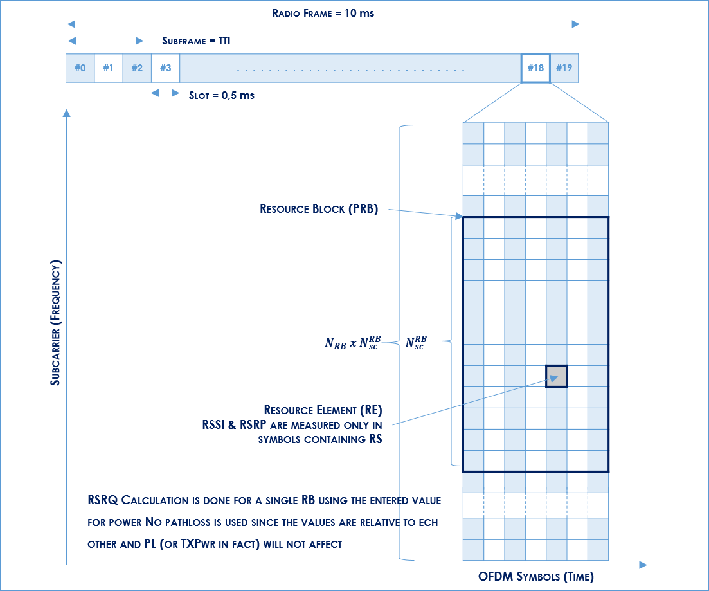
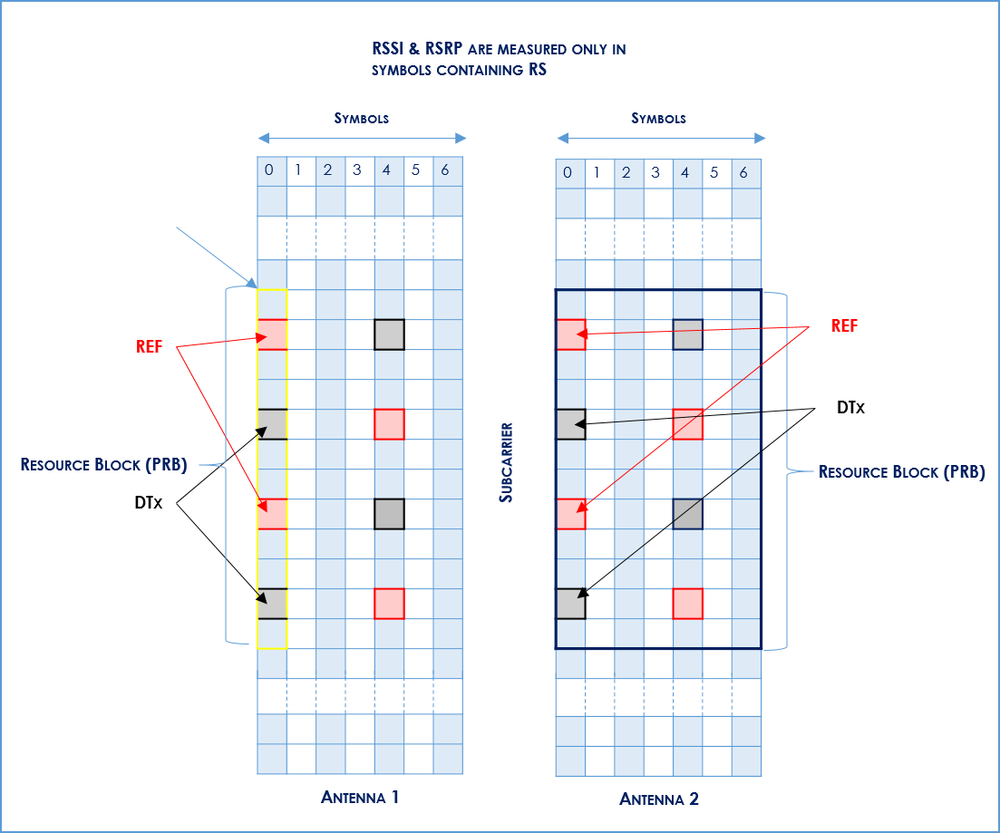

在 LTE 中，UE 做小区重选和切换时，最核心的测量量是 `RSRP` 和 `RSRQ`。本文按“先理解、再应用”的顺序梳理 `RSRP`、`RSRQ`、`RSSI`，并总结常见误区。

---

## 1. 先建立整体认知

你可以先把三个量理解成三种不同视角：

- `RSRP`：看“有用信号强不强”（覆盖视角）。
- `RSRQ`：看“有用信号在当前干扰环境下质量如何”（质量视角）。
- `RSSI`：看“总接收功率背景有多高”（环境视角，包含干扰与噪声）。

一句话记忆：**RSRP 偏覆盖，RSRQ 偏质量，RSSI 是背景。**

---

## 2. 三个量的定义与关系

### 2.1 RSRP 是什么

`RSRP`（Reference Signal Received Power）是：  
在测量带宽内，对承载小区参考信号（CRS）的资源元素（RE）功率做线性平均（结果常以 dBm 表示）。

它不是“整带宽总功率”，而是“参考信号 RE 的平均功率”。

PRB、RE 与 Cell-RS 的对应关系（含多天线下 DTX 分布）

  

        
  

  

       
  

### 2.2 RSRQ 是什么

`RSRQ`（Reference Signal Received Quality）定义为：

`RSRQ = N * RSRP / RSSI = RSRP / (RSSI/N)`

其中 `N` 是 RSSI 测量带宽内的 RB 数。`RSSI/N` 可理解为“每个 RB 的平均总接收功率”，因此 `RSRQ = RSRP/(RSSI/N)` 更直观。  
关键点是：**分子与分母必须在同一测量带宽、同一 RB 集上得到**。

为什么定义成 `N*RSRP/RSSI`，而不是 `(12*N)*RSRP/RSSI`？

- 目标是“工程可用”，不是最细粒度 RE 物理对齐；
- `N`（RB 数）对应带宽与调度尺度，跨场景更稳定、可比性更好；
- 若强行引入 `12` 做 RE 级归一化，会更依赖端口映射、RS 位置、DTX 等细节，工程上反而不稳；
- LTE 调度最小单位是 PRB，因此按 PRB 维度归一化更符合网优和移动性决策使用方式。

规范映射里 `RSRQ` 上报上限可到 `-3 dB`，明显高于很多资料常提到的 `-10.8 dB`。  
这两者并不矛盾，原因是它们对应的场景不同：

- `-10.8 dB`（`10*log10(1/12)`）来自“满载、等功率分布”的简化参考模型；
- `-3 dB` 反映更一般的可测场景（如低负载、低干扰时，分母 `RSSI` 下降，`RSRQ` 更接近 0 dB）；
- 所以 `-10.8 dB` 更像“满载直觉值”，`-3 dB` 才是规范映射上边界。

> [!tips] 工程直觉小结（便于记忆）
> - `RSRP` 更像“我离基站有多近”（覆盖/强度）。
> - `RSRQ` 更像“这条路有多堵”（质量，受负载与干扰共同影响）。
> - 当 `RSRP` 很好（如 `-70 dBm`）但 `RSRQ` 很差（如 `-15 dB`）时，通常表示覆盖没问题，但质量环境差（小区忙或干扰高），速率未必高。

> [!note] 补充边界
> - `RSRQ` 不是纯“负载指标”，它反映的是参考信号相对总背景功率（含负载相关发射、干扰、噪声）的质量。
> - `RSRP` 与距离强相关，但也会受天线方向、遮挡、频段和站点参数影响。

> [!example] 典型场景下的计算
> 1. 单天线下，一个 PRB 上所有 RE 都在传输数据，且每个 RE 上功率相同：`RSRQ = N/12N = -10.8 dB`
> 2. 双天线下，继承 1 的假设，CRS 不叠加，其他 RE 能量叠加：`(12 - 4) * 2 = 16`，再叠加 4 个 Cell-RS RE，总计 20 个 RE 能量：`RSRQ = N/20N = -13 dB`
> 3. 完全空载情况下，单天线：`RSRQ = N/2N = -3 dB`
> 4. 完全空载情况下，双天线：`RSRQ = N/4N = -6 dB`

RSRQ 报告范围示意（辅助记忆）  
![[images/CableFree-LTE-RSRQ-reporting-range.png]]

### 2.3 SINR/SNR 是什么

`SINR = S / (I + N)`

`SNR = S / N`

其中 `S` 是有用信号功率，`I` 是干扰功率，`N` 是噪声功率。
`SINR` 的核心是**同口径比较**：通常在同一组被统计资源（相同 RE/子载波/时频区域）上比较 `S` 与 `I+N`。

>[!tips] 工程直觉小结（便于记忆）
> - `RSRQ`：与 RS 口径强绑定，工程指标，偏移动性判决，口径有意设计为“混合统计”；
> - `SINR`：不一定强绑定 RS，也可基于其他已知序列（如 `CRS`、`DM-RS`、`CSI-RS`）估计；作为链路质量指标，通常同口径对比，更贴近解调条件与吞吐表现。
> - `SNR` 更像“底噪有多干净”，`SINR` 更像“底噪 + 外部干扰合起来有多干净”。所以同样 `RSRP` 下，`SNR` 好不代表 `SINR` 一定好（可能干扰很高）。

### 2.4 RSSI 是什么

`RSSI`（Received Signal Strength Indicator）是总接收功率统计量，包含服务小区功率、其他小区干扰以及热噪声等（按规范规定的符号和带宽条件统计）。

统计口径上，`RSSI` 不是“一个 slot（0.5ms）里所有 RE 的简单总和”，也不是只取某一个 symbol。
根据 `36.214`，`RSSI` 的统计口径是“默认规则 + 高层可配置规则”：

| 场景 | RSSI 统计符号范围 |
|---|---|
| 默认（未被高层特别指示） | 仅统计包含参考信号（antenna port 0 RS）的 OFDM symbols |
| 高层指示 `all OFDM symbols for performing RSRQ measurements` | 统计测量子帧下行部分的所有 OFDM symbols |
| 高层指示特定子帧/发现信号测量场景 | 按指示的子帧或 discovery signal occasions 统计对应下行 OFDM symbols |

无论采用哪种符号范围，`RSSI` 统计逻辑都一样：
- 在每个被选中的 OFDM symbol 上，先对测量带宽内（`N` 个 PRB）的接收功率做总和；
- 再在这些被选中的 OFDM symbols 维度上做线性平均。

速记：`RSSI = PRB 维度求和 + symbol 维度线性平均`，且 symbol 选择可由高层配置改变。

常见直觉表达可以写成：

`RSSI = wideband power = noise + serving cell power + interference power`

这个表达用于理解 RSSI 组成是正确的。  
`RSSI` 是总接收功率（有用信号 + 噪声 + 干扰）；在满载、等功率分布且采用对应统计口径的理想化前提下，可近似写为：`RSSI ~= 12*N*RSRP`。

可把它理解为两种统计视角：
- `RSRP` 更像“点状统计”（单个参考信号 RE 的平均功率）；
- `RSSI` 更像“面状统计”（测量带宽内相关 RE 的总功率）。

其中 `N` 为测量带宽内的 PRB 数。  
注意：这不是所有场景都严格成立的恒等式，真实网络中会受负载、端口配置、功率分配与干扰环境影响。

---

## 3. 为什么切换/重选要同时看 RSRP 和 RSRQ

只看 `RSRP`，可以判断覆盖是否足够；但当干扰升高时，`RSRP` 可能还可以，业务质量却已经变差。  
这时 `RSRQ` 能补上“质量信息”，帮助识别“信号不弱但质量差”的场景。

工程上常见思路：

- 用 `RSRP` 做候选小区强度排序；
- 用 `RSRQ` 作为质量补充判据；
- 最终由 RRC 事件参数（如 A3/A5）控制上报与触发。

图3 切换中覆盖与质量的分工（示意）  
![[images/CableFree-LTE_Network_little.png]]

---

## 4. 学习中最常见的 5 个误区

1. **把 RSRP 当成整带宽总功率**  
   纠正：RSRP 是参考信号 RE 平均功率，不是全带宽总功率。

2. **把经验阈值当成规范阈值**  
   纠正：网页中的固定门限常是经验值，不是通用 3GPP 硬门限。

3. **把特定推导结果泛化到所有场景**  
   纠正：许多结论依赖前提（负载、天线、功率分配等），前提变了结论也会变。

4. **忽略“同一 RB 集测量”约束**  
   纠正：`RSRQ = N*RSRP/RSSI` 的前提是同一测量集合。

5. **把天线影响当成唯一因果**  
   纠正：天线配置会影响统计结果，但定义本身仍是 `N*RSRP/RSSI`。

## 5. 相关内容在协议中的位置

- `TS 36.214`：测量定义与口径（RSRP/RSRQ/RSSI 的核心出处）。
- `TS 36.133`：上报范围、精度、性能要求。
- `TS 36.331`：测量配置、触发事件（A1~A5）、上报机制。
- `TS 36.211`：CRS 与物理资源映射细节。

## 6. 参考资料

- https://www.cablefree.net/wirelesstechnology/4glte/rsrp-rsrq-measurement-lte/
- https://arimas.com/2016/04/04/78-rsrp-and-rsrq-measurement-in-lte/

