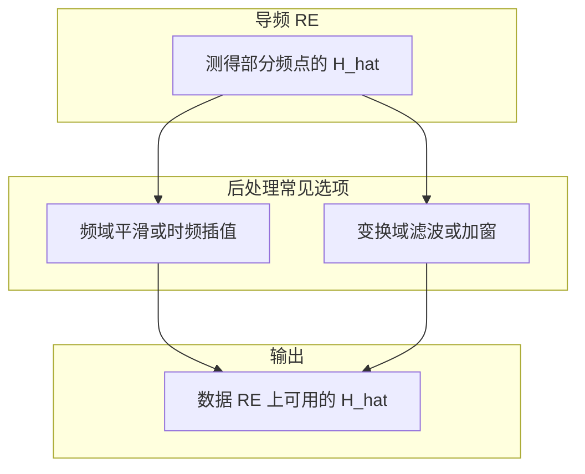
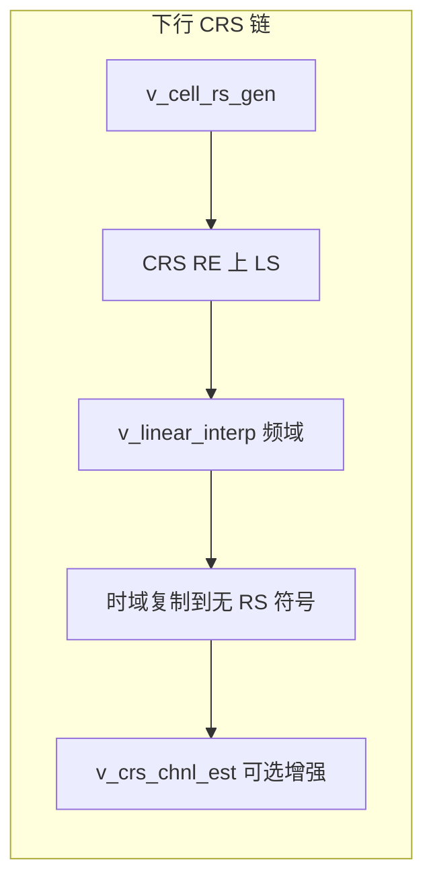
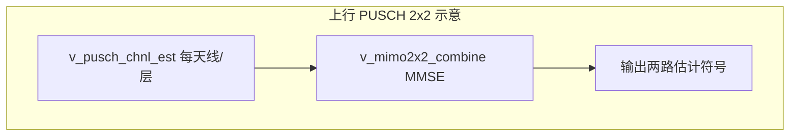

本文从「信道估计（channel estimation）」在 **SISO → MIMO** 的脉络出发，把网上一篇图解式博文中的**直觉**与 **LTE/OFDM 工程里常见的处理链条**对齐说明；文中对**规范条文**与**教学/经验表述**会分开标注，便于你在 Obsidian 里长期维护与分享。

---

## 1. 整体认知

通信里，发射信号经过无线介质会变成「失真 + 噪声 +（多天线时）相互耦合」的接收信号。接收端要可靠解调，第一步往往是：**弄清当前时刻、当前频点上的信道特性**，这个过程统称 **信道估计**。高层流程可以记成四步（与 [博客园：信道估计图解——从 SISO 到 MIMO](https://www.cnblogs.com/louisanu/p/13046621.html) 的叙述一致）：

1. 建立数学模型：用矩阵把发射、信道、接收联系起来。  
2. 发送**已知**的参考信号（导频 / RS / pilot）。  
3. 在接收端检测这些 RE 上的接收值。  
4. 比较「已知发送」与「实际接收」，反推出信道矩阵（及噪声的统计特性）。

在 **OFDM** 系统中，信道往往在**频域**逐子载波描述；因此你看到的常是「每个频点一个系数」或「每个频点一个小矩阵 $\mathbf{H}$」，再在时间/频率上插值、平滑。

> [!note] 规范结论 vs 经验说法
> - **规范结论**：LTE 中参考信号位置、序列、功率等由 **3GPP TS 36.211** 等规定；具体芯片/仿真如何实现「插值、加窗、去噪」属于**实现细节**，不同厂商可不同。  
> - **经验说法**：博客中「先关掉一根天线发单位幅度」等叙述，用于建立**直觉**；真实 LTE 在 **2×2 MIMO** 下利用 **不同天线端口上 RS 的时频图样**完成估计，而不是长期只发导频不传业务。

---

## 2. 概念与定义

### 2.1 信道估计（channel estimation）

**信道估计**指：利用收发两端**事先约定的参考信号（导频）**，在接收端对应 RE 上的观测，反推出信道对信号的作用（频域响应或等效描述）。

- **SISO**：常表现为每个频点一个复系数（或很短的一小段系数向量）。  
- **MIMO**：常表现为每个频点一个矩阵 $\mathbf{H}$，把多天线之间的耦合一并写进矩阵元里。  

此外，许多接收算法还需要噪声的**二阶统计量**（方差、空间协方差等）；它们往往与信道估计在同一条处理链上得到，用于均衡、检测与链路自适应。**为何强调「统计」而非某一瞬时值**，见 **§2.3**。

### 2.2 SISO 与 MIMO 模型

- **SISO**：一个子载波上常写 $y = h\,x + n$。若导频处 $x$ 已知、$y$ 可测，可用最小二乘（LS）等得到 $\hat{h} \approx y/x$（忽略噪声时为理想形式；有噪声时需平滑、正则或维纳类估计）。  
- **MIMO（以 2 发 2 收为例）**：

$$
\mathbf{y} = \mathbf{H}\,\mathbf{s} + \mathbf{n},\quad
\mathbf{H} = \begin{bmatrix} h_{11} & h_{12} \\ h_{21} & h_{22} \end{bmatrix}
$$

**经验约定（与多数教材一致）**：**行 = 接收天线索引，列 = 发送端口/层索引**。则 $h_{ij}$ 表示：第 $j$ 个发送端口到第 $i$ 根接收天线的一条空间链路，共 **4 条链路、4 个复系数**（不是组合数学里的「组合」计数）。

### 2.3 与「噪声估计」的关系

承接 **§2.1**：那里说的噪声**二阶统计量**，在工程上多半指「可在一段时频窗内复用的 $\mathbf{R}_n$ 近似」，而不是某一个 RE、某一次观测里**抠出来的单个噪声样本**。

- **为何更重视统计量（经验说法）**：噪声与残留干扰的实现随时间随机跳变，**单点样本**对下一时刻、另一组 RE 的**可移植性**往往很差；但在适当窗长内平均得到的方差、协方差等，变化较慢，适合喂给 **MMSE、IRC、SINR 估计** 等模块。  
- **与博客表述的对应**：[信道估计图解博文](https://www.cnblogs.com/louisanu/p/13046621.html)里强调「要噪声的总体特性、不要执着于单次样本」，与上述习惯一致。  
- **与规范的关系**：3GPP 通常规定**测量与性能的外沿**；接收机内部用何种窗长、何种方法估计 $\mathbf{R}_n$，**属实现细节**，不同芯片/仿真可不同。

---

## 3. 公式与直觉

> [!note] Obsidian 提示
> - 标题行（`###`）里**尽量不放** `$...$`，部分主题/模式下标题内数学不渲染。  
> - 若仍看到 `$\mathbf{x} $` 这种「美元符旁有空格」的源码，多半是**打开了旧副本**；请以本库路径 `DOCs/信道估计：从SISO到MIMO（原理与工程对照）.md` 为准重新打开或同步。

### 3.1 从「对比收发」到「得到信道矩阵估计」

目标量：$\hat{\mathbf{H}}$（矩阵形式）。

在导频 RE 上，$\mathbf{x}$（或各端口 RS）与 $\mathbf{y}$ 已知/可测时，可在 LS 意义下解 $\mathbf{y} \approx \mathbf{H}\mathbf{x}$。

**直觉**：信道把「已知图案」扭成「接收图案」，**对比两者**即可反推 $\mathbf{H}$。

### 3.2 2×2 MIMO 的「逐列」直觉（教学用）

博文用简化故事说明：**若某一时刻只有端口 0 发单位参考、端口 1 不发**，则在无噪声理想下，两路接收可读出 $\mathbf{H}$ 的**第一列**；**再换只有端口 1 发**，读出**第二列**。真实 LTE 利用 **各端口 RS 的时频正交/错开**，在**同一子帧内**与业务并行，不必长期「只发导频」——此处为**直觉模型**，**非**规范对 RS 设计的唯一描述。

### 3.3 频域上「只有部分 RE 有导频」——为何要插值

导频只占据部分 **RE**，数据占据其余 RE。对数据 RE 上的信道，常用 **频域/时域插值**、**平滑/加窗**（博文提到 IFFT→时域脉冲响应→滤波→FFT 的一类后处理，与开源 srsLTE 思路相近，属**实现经验**）。

### 3.4 噪声的二阶统计与后续检测

在得到 $\hat{\mathbf{H}}$ 后，可用残差 $\mathbf{y} - \hat{\mathbf{H}}\mathbf{x}$ 在导频邻域估计噪声相关矩阵 $\mathbf{R}_n$（**经验/算法**）。**MMSE 类接收**常出现 $\mathbf{H}\mathbf{H}^H + \mathbf{R}_n$ 形式，体现「信号子空间 + 噪声协方差」折中（见下一节工程对照）。

---

## 4. 工程应用

### 4.1 LTE 链路中的典型位置（概念链）

**规范结论**：下行/上行参考信号资源位置、序列与天线端口映射由 **36.211** 规定；物理层接收机如何具体做信道估计与均衡，在 **36.213/实现** 中体现为能力与测试要求，算法细节通常**不**在规范中单点写死。

**经验链路**（仿真或基带常采用的抽象）：

1. **导频处**做 LS/维纳等，得到稀疏 $\hat{H}$。  
2. **插值/平滑**得到全带宽、全时隙可用的 $\hat{H}(f,t)$。  
3. **数据检测**：ZF/MMSE 等；MMSE 常需 $\mathbf{R}_n$ 或其估计。  

与 MathWorks 文档中对 `lteDLChannelEstimate` 等流程的描述一致：提取导频 → LS → 降噪/平均 → 插值（见 [Channel Estimation - MATLAB & Simulink](https://www.mathworks.com/help/lte/ug/channel-estimation.html)）。

### 4.2 与示例代码库的对照（经验）

在独立仿真/验证仓库中，常见分工是：

| 环节 | 作用 |
|------|------|
| 信道估计模块 | 输出各子载波上的 $\hat{h}_{ij}$ 或 $\hat{\mathbf{H}}$ |
| 噪声统计估计 | 由参考或残差得到 $\mathbf{R}_n$ 的近似（如按 RB 平均） |
| 线性均衡（如 MMSE） | 用 $\hat{\mathbf{H}}$ 与 $\mathbf{R}_n$ 构造合并矩阵 |

例如上行 **2×2** 合并中，对每个子载波构造 $\mathbf{H}$，并配合估计的噪声协方差 $\mathbf{R}$，计算形如 $\mathbf{W} = \mathbf{H}^H (\mathbf{H}\mathbf{H}^H + \mathbf{R})^{-1}$ 的权重，再对接收向量线性合并——这与「先估信道、再估噪声二阶量、再做 MMSE」的链条一致。下文 **§4.3** 给出本机仿真仓库中的**具体文件与调用关系**（经验实现，非 3GPP 条文）。

### 4.3 仿真仓库 `jt_validate_ca`：信道估计与均衡实现索引

> [!note] 路径说明
> 下列路径相对于仓库根目录 **`jt_validate_ca`**（与 `3GPP learning` 笔记库可位于不同目录；阅读时以你本机克隆路径为准）。

#### 下行（CRS）：从已知参考到 $\hat{H}$ 再到均衡

| 文件 | 作用（经验归纳） |
|------|------------------|
| `Downlink/v_cell_rs_gen.m` | 按 **36.211** 思路生成 **Cell-specific RS（CRS）** 序列及映射相关量；为 LS 提供已知 $s$。 |
| `Downlink/v_dl_chan_est.m` | **主入口**：TDD 下若子帧为上行则跳过；否则对每对 $(i,k)$ 收/发天线，在 CRS RE 上做 **$\hat{h} \approx r \cdot \mathrm{conj}(s)$**（参考功率归一假设），再 **频域线性插值**（`v_linear_interp`）填满子载波，**时域**将含 RS 的符号结果复制到无 RS 符号；部分 OFDM 行再调用 `v_crs_chnl_est` 做增强。输出嵌套胞元 `h{i}{k}` 与 `rs_rpt`。 |
| `Downlink/v_crs_chnl_est.m` | **CRS 频响后处理**：对一段频域 $\hat{H}$ 做 **频域扩展 + 余弦窗衔接 → IFFT 得 PDP → 时域去噪/置零 → FFT 回频域**；扩展长度 $L$ 借 **`v_get_ul_bw_idx` / `v_get_ul_bw`** 查「下一档带宽 PRB 数」算出差分（实现细节见该文件头注释）。 |
| `Downlink/v_dl_rs_analyze.m` | 在 CRS 估计结果上提取 **dBTo1、rms、time_off** 等报告量，供调试与链路质量观察。 |
| `Downlink/v_dl_chan_equ_div.m` | 利用已估 CRS 信道做 **下行均衡**（除法型合并等，与估计模块衔接）。 |

**典型调用方（grep 归纳）**：`Downlink/v_dl_analyzer_smallcell.m`、`v_dl_analyzer.m`、`v_dl_sfrm_analysis.m`；上行侧分析里复用下行 CRS 的如 `Uplink/v_analyzer_smallcell.m`、`v_ul_ant_wv_reorder_smallcell.m` 等也会调用 `v_dl_chan_est`。

#### 上行（PUSCH）：按层/天线估信道 → MMSE 合并

| 文件 | 作用（经验归纳） |
|------|------------------|
| `Uplink/v_pusch_chnl_est.m` | **PUSCH 单 slot 频域信道后处理**：对接收得到的频域信道系数做 **扩展 → IFFT → PDP 上抑制噪声 → 回 FFT**（与下行 `v_crs_chnl_est` 同族思路，参数表针对 PUSCH）。 |
| `Uplink/v_pusch_ch_equ.m` 等 | **单流/分集**：`v_pusch_ch_equ_single_ant_0.m`、`…_1.m`、`v_pusch_ch_equ_mrc.m`、`v_pusch_ch_equ_irc.m` 等在各自流程中调用 `v_pusch_chnl_est` 得到平滑后的 $\hat{H}$，再接 MRC/IRC 等合并。 |
| `Uplink/v_pusch_ch_equ_mimo2x2.m` | **双流 2×2**：对每层、每接收天线调用 `v_pusch_chnl_est` 得到 `ch_layer0/ch_layer1`，再调用 **`v_mimo2x2_combine`**，传入四路 $h_{11}\ldots h_{22}$ 与噪声辅助量 `n0,n1` 及接收 `r0,r1`，完成 **MMSE**（见该函数头与附录）。 |
| `Uplink/v_mimo2x2_combine.m` | **MMSE 线性合并**：按 RB 估 $\mathbf{R}$，逐子载波 $\mathbf{W}=\mathbf{H}^H(\mathbf{H}\mathbf{H}^H+\mathbf{R})^{-1}$；文件内附 **MMSE 与 2×2 MIMO** 学习附录（与 Gold/PN 无关；PN 见 `Common/v_pn_seq_gen.m`）。 |

#### 与「参考信号生成」强相关、但非信道估计主链

| 文件 | 说明 |
|------|------|
| `Common/v_pn_seq_gen.m` | **Gold / 伪随机序列**；规范 36.211 §7.2；CRS/加扰等多处会用到同类序列生成。 |
| `Downlink/v_calc_rsrp.m` | **RSRP-like**：在已提取 CRS RE 接收符号上，与 **PCI 相关本地序列**做匹配式度量（与纯能量平均的 RSSI 类指标不同），依赖 `v_pn_seq_gen` 等。 |

#### 与 MathWorks 文档的粗对照（学习用）

| 本仓库抽象步骤 | MathWorks LTE Toolbox 常见步骤 |
|----------------|----------------------------------|
| CRS 位置 LS + 频域插值 + 时域填洞 | `lteDLChannelEstimate` 中 LS、平滑、插值组合 |
| `v_crs_chnl_est` / `v_pusch_chnl_est` 的 IDFT 域去噪 | 类似「变换域 / 时域滤波」类可选后处理 |

### 4.4 其他图解来源（便于扩展阅读）

- [ShareTechnote：Channel Estimation 总览](http://www.sharetechnote.com/html/Communication_ChannelEstimation.html#General_Algorithm)：英文图解 + 多制式索引，适合与本文并列查阅。  
- [MathWorks：`lteDLChannelEstimate` 参考页](https://www.mathworks.com/help/lte/ref/ltedlchannelestimate.html)：函数级参数与实现说明，适合对照仿真代码。

---

## 5. 常见误区

> [!tips] 行列约定
> 不同文献把 $\mathbf{H}$ 写成转置或交换「行/列含义」，**物理上仍是四条链路**，但必须与 $\mathbf{y}$、$\mathbf{s}$ 的定义一致，否则均衡器会整体错位。

> [!tips] 瞬时噪声 vs 统计量
> 某一 RE 上算出的噪声样本**不能**直接当作所有 RE、所有符号上的噪声；接收算法需要的是**可重复的统计近似**（方差、协方差）。

> [!note] SINR 与 SNR
> 若文中混用干扰与噪声，应分清 **SNR**（对热噪声）与 **SINR**（含干扰）；链路质量与调度策略依赖的口径不同。

> [!note] 「关掉一根天线」仅为直觉
> 实际 LTE **2×2** 利用 **CRS/解调 RS** 的时频资源与正交性完成多端口估计，不必也不应理解为长期物理关断某一发射链。

---

## 6. 进阶阅读路径

1. **入门直觉（中文图解）**：[信道估计（channel estimation）图解——从 SISO 到 MIMO 原理介绍](https://www.cnblogs.com/louisanu/p/13046621.html)（博客园，**学习向**，非 3GPP 原文）。  
2. **英文图解索引**：[ShareTechnote - Channel Estimation](http://www.sharetechnote.com/html/Communication_ChannelEstimation.html)。  
3. **可执行参考（MATLAB）**：[LTE Toolbox - Channel Estimation](https://www.mathworks.com/help/lte/ug/channel-estimation.html) 及 `lteDLChannelEstimate` / `lteULChannelEstimate` 文档。  
4. **规范向**：从 **3GPP TS 36.211**（参考信号与资源映射）→ **36.213**（物理层过程）建立「导频从哪来、接收机要满足什么」的框架，再回读仿真实现。  
5. **本仓库实现索引**：同文档 **§4.3**（`jt_validate_ca` 中 CRS/PUSCH/MMSE 等文件与调用关系）。

---

## 7. 速记总结

- **信道估计** = 用**已知参考**在接收端反推 $\mathbf{H}$，并常估计 **噪声统计量**。  
- **OFDM**：频域逐点（或逐矩阵）的 $\hat{\mathbf{H}}$，再 **插值/平滑** 到数据 RE。  
- **MIMO**：$\mathbf{H}$ 的每个元素 = 一条 **发端口 → 收天线** 链路；**2×2** 共 **4 个复系数**。  
- **MMSE 检测**在工程上常接在「信道估计 + 噪声协方差估计」之后，出现 $\mathbf{H}\mathbf{H}^H+\mathbf{R}_n$ 结构是**正常形态**，不是两套无关理论。  
- **一页收齐**：原理与误区见 §1–§3、§5；**工程代码路径与数据流**见 **§4.3**；外链见 §4.4、§6。

---

## 图片来源与本地配图说明

- **Obsidian 与 LaTeX 定界符**：默认内置 MathJax，**行内**用 `$...$`、**独立公式块**用单独一行的 `$$` … `$$`。`\(...\)`、`\[...\]` 常见于 Pandoc / 学术模板，**Obsidian 阅读视图不会按公式渲染**，易被当成普通字符；**一般不必额外装插件**，除非你希望扩展语法（如 `chem`、编号公式等）。
- **行内公式的紧凑写法**：`$` 与公式内容**紧贴**，闭合 `$` 后也**不要**在 `$` 内侧留空格（避免写成「`$` 空格 + 公式 + 空格 + `$`」）；公式与中文之间用正文空格分隔即可，例如：`与 $\mathbf{y}$ 已知`。

- 本文**示意图使用 Mermaid** 内嵌，便于 Obsidian 直接渲染。若你更习惯博文中的截图，可自行从 [该博客原文](https://www.cnblogs.com/louisanu/p/13046621.html) 截取关键插图，保存到本库 `DOCs/images/` 下，在正文相应小节用 Obsidian 嵌入语法引用（双括号、路径相对本库 `DOCs`；**勿用反引号包裹整行嵌入语句**，见《AI协作规则》第 4 节）。

- MathWorks、ShareTechnote 页面截图版权归原站点所有，转载分享时请遵守其使用条款。
