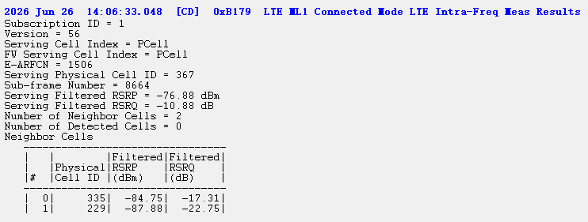
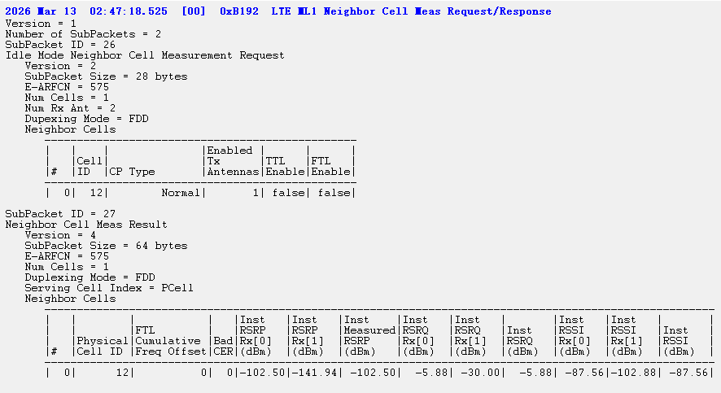

# LTE ML1 Serving Cell Meas Response

服务小区测量
```
2026 Jun 26  14:06:32.415  [00]  0xB193  LTE ML1 Serving Cell Meas Response
Subscription ID = 1
Version = 1
Number of SubPackets = 1
SubPacket ID = 25
Serving Cell Measurement Result
   Version = 56
   SubPacket Size = 176 bytes
   E-ARFCN = 1506
   Num of Cell = 1
   Cells[0]
      Valid Rx = RX0_RX1
      Logical To Physical Rx Map = { 1, 0, NA, NA }
      Physical Cell ID = 367
      Serving Cell Index = PCell
      FW Serving Cell Index = 0
      Is Serving Cell = 1
      Current SFN = 802
      Current Subframe Number = 7
      Is Restricted = false
      Cell Timing[0] = 5728
      Cell Timing[1] = 5728
      Cell Timing SFN[0] = 802
      Cell Timing SFN[1] = 802
      Inst RSRP Rx[0] = -84.19 dBm
      Inst RSRP Rx[1] = -76.88 dBm
      Inst RSRP Rx[2] = NA
      Pathloss RSRP Rx[2] = NA
      Pathloss RSRP Rx[3] = NA
      Inst RSRP Rx[3] = NA
      Inst Measured RSRP = -76.88 dBm
      Filtered RSRP = -77.81 dBm
      Inst RSRQ Rx[0] = -16.88 dB
      Inst RSRQ Rx[1] = -16.19 dB
      Inst RSRQ Rx[2] = NA
      Inst RSRQ Rx[3] = NA
      Inst RSRQ = -16.19 dB
      Filtered RSRQ = -13.00 dB
      Inst RSSI Rx[0] = -50.31 dBm
      Inst RSSI Rx[1] = -43.69 dBm
      Inst RSSI Rx[2] = NA
      Inst RSSI Rx[3] = NA
      Inst RSSI = -43.69 dBm
      FTL SNR Rx[0] = 2.60 dB
      FTL SNR Rx[1] = 5.30 dB
      FTL SNR Rx[2] = NA
      FTL SNR Rx[3] = NA
      Projected Sir = 0 dB
      Post Ic Rsrq = -2e+001 dB
      CINR RX 0 = 448
      CINR RX 1 = 1223
      CINR RX 2 = NA
      CINR RX 3 = NA
```

# LTE ML1 Cell Measurement Results

服务小区和同频邻区测量

```
2026 Jun 26  14:06:32.493  [CD]  0xB196  LTE ML1 Cell Measurement Results
Subscription ID = 1
Version = 41
Num Cells = 3
Is 1Rx Mode = 0
Cell Measurement List
   ------------------------------------------------------------------------------
   |   |       |        |       |Inst   |Inst   |Inst   |Inst   |Inst   |Inst   |
   |   |       |        |       |RSRP   |RSRP   |RSRQ   |RSRQ   |RSSI   |RSSI   |
   |   |       |Physical|Valid  |Rx[0]  |Rx[1]  |Rx[0]  |Rx[1]  |Rx[0]  |Rx[1]  |
   |#  |E-ARFCN|Cell ID |Rx     |(dBm)  |(dBm)  |(dBm)  |(dBm)  |(dBm)  |(dBm)  |
   ------------------------------------------------------------------------------
   |  0|   1506|     367|RX0_RX1| -84.13| -76.88| -14.75| -13.63| -52.31| -46.25|
   |  1|   1506|     335|RX0_RX1| -86.25| -89.75| -22.50| -17.88| -54.69| -62.81|
   |  2|   1506|     229|RX0_RX1| -88.06| -93.75| -22.56| -23.00| -56.44| -61.75|
```

# LTE ML1 Connected Mode LTE Intra-Freq Meas Results

同频邻区的测量

# LTE ML1 Neighbor Cell Meas Request/Response

异频邻区的测量
